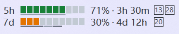

# Codex Usage TrafficMonitor Plugin

This plugin ports the Codex portion of Codex Usage Monitor into TrafficMonitor. It draws segmented 5-hour / 7-day remaining-quota rows, reads today's cumulative token totals from local Codex session logs, and shows account/reset-credit details in a scrollable popup.



## Build and try in PluginTester

This directory is the sole source for the Codex plugin. The TrafficMonitor host repository loads the DLL and does not contain or build a source copy of this plugin.

Build `CodexUsage` and `PluginTester` as the same platform and configuration from `TrafficMonitorPlugins.sln`. Both outputs go to `bin/<Platform>/<Configuration>/`, so `PluginTester.exe` discovers `CodexUsage.dll` from its current directory. Start the tester, choose **Codex quota**, then inspect the preview, dark background, two-row layout, tooltip, and click popup.

This plugin targets TrafficMonitor plugin API 8, including the exclusive two-row item layout. API 8 has no plugin shutdown callback, so keep the DLL loaded until the host process exits.

Click the item to open the detail popup, or right-click it for the details and manual-refresh commands. The host tooltip contains a short quota summary; account and token details stay in the plugin popup. This first port covers Codex; Claude Code, Antigravity, and quota notifications are not included.

Quota cells use the same remaining-quota thresholds and light/dark palette as codex-usage-monitor: above 50% is green, above 20% through 50% is amber, and 20% or less is red.

## Data and privacy

The plugin reads the access token and optional account ID from `%CODEX_HOME%\\auth.json`, or `%USERPROFILE%\\.codex\\auth.json` when `CODEX_HOME` is not set. It sends the token only in HTTPS authorization headers to the Codex usage and reset-credit endpoints. It does not write credentials or API responses to disk or logs.

For today's local token totals, it scans active and archived Codex session JSONL files updated since local midnight, including chats created on earlier dates. It counts cumulative token-count increments whose event timestamps fall within today, using the previous day's final event as the baseline. Duplicate active/archive copies are counted once. The summary contains input, cached input, output, reasoning, total, session count, and unreadable-log count.

The total also shows a conversion to units of 100 million tokens (亿 in Chinese), alongside the full token count.

## Configurable workdays and holidays

The time bar uses Beijing civil dates. Five-hour markers for 09:30, 12:00, 13:30 and 18:30 appear only on working days. Weekly markers separate continuous working-day and rest-day periods, including official holidays and make-up workdays.

The time bar keeps its original gray for working periods and uses a muted gray for rest periods, with enough contrast against the host background. On the weekly bar, all hours of a workday count as working periods. On the five-hour bar, only 09:30–12:00 and 13:30–18:30 on workdays count as working periods; lunch, evenings and holidays use the rest color.

The plugin options let you choose the weekly rest pattern: two days off (Saturday and Sunday), one day off (Sunday), or alternating A/B weeks. A means Saturdays are off on odd ISO weeks; B is the opposite phase. Official holidays and make-up workdays still take precedence. The five-hour bar's morning and afternoon start/end times are also editable in `HH:mm` format (defaults: 09:30, 12:00, 13:30 and 18:30). The compact time-bar section is disabled when the time bar itself is hidden.

Edit `calendar/YYYY.txt` beside the installed `CodexUsage.dll` (usually `plugins/calendar/2026.txt`). Each UTF-8 file belongs to the year in its filename. Lines use these formats; range endpoints are inclusive:

```text
# Comments begin with #. A UTF-8 BOM is accepted.
holiday 2026-10-01 2026-10-07
workday 2026-10-10
```

Make-up workdays override holidays, then unlisted dates fall back to Monday-Friday. Missing years also use Monday-Friday; they do not inherit another year's holiday schedule. Invalid lines, dates or ranges spanning different years are ignored. Split a cross-year range across the two annual files.

The bundled 2026 table follows the [State Council's official 2026 notice](https://www.beijing.gov.cn/zhengce/zhengcefagui/202511/t20251104_4258873.html). No predicted 2027 table is bundled. When the official schedule is published, add `2027.txt` in the same format; no recompilation is required. Calendar edits reload with the next data refresh (normally after a 60-second wait); use the plugin's manual refresh command to reload sooner.

Building the plugin copies the source `calendar/*.txt` files alongside its output DLL. Install both the DLL and calendar folder. The host installation/restart scripts add missing annual files and preserve existing calendar files, so edit the installed file or deliberately replace it when updating a year's schedule.

To run the calendar regression checks, open an x64 Visual Studio developer terminal in `Plugins/CodexUsage`, compile `tests/WorkdayCalendarTests.cpp` with `cl /std:c++17 /EHsc /UNDEBUG`, and run the generated `WorkdayCalendarTests.exe` from that same directory. It checks all bundled holiday/make-up dates, workday precedence, malformed input, missing-year fallback and time-bar marker placement.

The plugin currently displays Codex data only. It includes the custom detail panel, but its labels currently support Chinese and English rather than all languages offered by the standalone monitor.

## Display and refresh

The quota display has ten narrow vertical cells per row. Each cell represents 10%; partial quota fills the cell from the bottom. A thin gray line below each row shows its remaining time ratio. Reset cards show expiry days, switching to hours or minutes near expiry.

Click the item to open or close the grouped detail panel. The panel also closes with its close button, Escape, or when the pointer leaves the popup and its opening position. Account, quota and local token data refresh after a 60-second wait following each refresh; visible countdowns update every second. Manual refresh is available in the plugin commands.

Compact quota text shows the percentage directly, without the Chinese `余` prefix. The popup header includes an **Open Codex App** button (Chinese: `打开 Codex App`). It opens the installed Windows app through `shell:AppsFolder\OpenAI.Codex_2p2nqsd0c76g0!App`; the desktop app must be installed. This launches the desktop app rather than the Codex CLI.

While either the Codex or Qoder detail panel is visible, the owning TrafficMonitor window's native tooltip is hidden and prevented from showing again. Closing or hiding all panels restores normal host tooltips. Shared suppression counts support overlapping plugin panels. The guard also intercepts repeated host show requests, so a stationary pointer cannot bring the host tooltip back over an open detail panel.

## Plugin options

Open TrafficMonitor's plugin manager, select Codex Usage, and choose plugin options.
The dialog follows the host's Chinese or English language and supports:

- Refresh after 1, 5, or 15 minutes, or 1 hour (default: 1 minute).
- Follow the host theme, or use light/dark quota text and bar colors.
- Segmented or continuous quota bars; compact or detailed quota text.
- Show the 5-hour and/or 7-day quota (at least one must remain visible).
- Show reset cards and the time bar independently.
- Choose two-day, one-day, or alternating A/B weekly rest schedules, and set the five-hour bar's four work-period boundaries.

Defaults preserve the existing display. Settings apply on OK and persist in
`CodexUsage.ini` in TrafficMonitor's plugin configuration directory. Cancel leaves
settings unchanged. A save failure keeps the dialog open and reports the error.
Position/background remain host settings. These display switches affect the host
item; the detail popup retains complete account, quota and token information.
Changing settings requests an immediate refresh. Poll intervals are waits after
each refresh, as in the existing plugin.

UI/config regression test: compile `tests/OptionsDialogTests.cpp` in an x64 Visual
Studio developer prompt with `/std:c++17 /EHsc /UNDEBUG` and link `user32.lib gdi32.lib`.
Run with the built `CodexUsage.dll` path. It uses a temporary config directory and
checks cancel, apply, unchanged OK, reload, and single-row continuous drawing.
